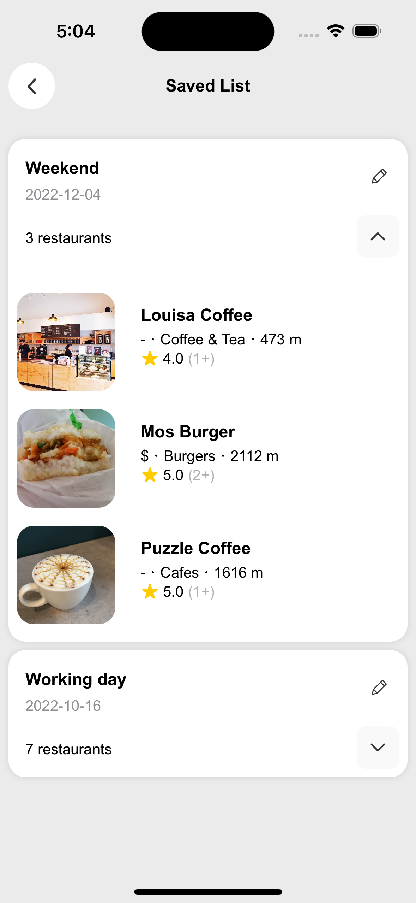
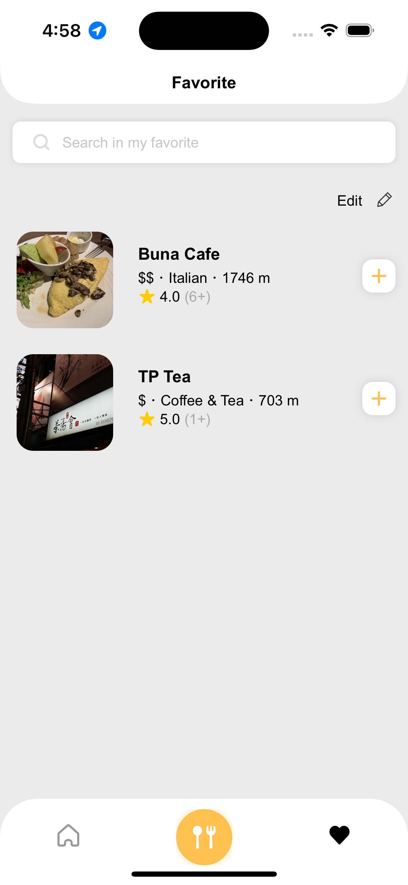

# Pickers

## Demonstration


### Table of Contents
<ol>
  <li>
    <a href="#about-the-project">About The Project</a>
  </li>
  <li><a href="#built-with">Built With</a></li>
  <li><a href="#feature">Feature</a></li>
  <li>
    <a href="#getting-started">Getting Started</a>
    <ul>
      <li><a href="#prerequisites">Prerequisites</a></li>
      <li><a href="#installation">Installation</a></li>
    </ul>
  </li>
  <li><a href="#contributors">Contributors</a></li>
  <li><a href="#acknowledgements">Acknowledgements</a></li>
</ol>

<!-- ABOUT THE PROJECT -->
## About The Project

Picker is aim to resolve the most difficult problem.

`What should I eat for lunch?`

By searching the restaurants nearby, users can pick whatever they like into the lottery wheel, and the wheel will randomly choose one for them.

## Built With
Architecture:
- MVVM+C 
  --- Modal-View-ViewModel+Coordinator

Network：
- [Yelp fusion](https://www.yelp.com/developers/documentation/v3)

- [Alamofire](https://github.com/Alamofire/Alamofire)
  --- Use this third party library to write network stuff elegantly.

- [Moya](https://github.com/Moya/Moya)
  --- Abstract network layer, for manage different endpoint and app networking

Local storage:
- [Core Data](https://developer.apple.com/documentation/coredata)
  --- Save user favorite restaurants and picker list.

UI components：

Most of the components are built with UIKit, few are SwiftUI.

Thirt party library

- [MBProgressHUD](https://github.com/jdg/MBProgressHUD)
  --- Loading View

- [imageSlideShow](https://github.com/zvonicek/ImageSlideshow)
  --- The image slide show base on alamofire, it can load image asynchronously and cache it.
- [LuckyWheel](https://github.com/AhmedNasserSh/iOSLuckyWheel)
  --- An iOS Lucky wheel with customizable text and text colors and section colors and very easy to integrate.

<!-- GETTING STARTED -->

## Getting Started

### Installation

1. Clone the repo
   ```sh
   git clone https://github.com/hanlinchentw/Pickers.git
   ```
2. Enter pod install in terminal
   ```Swift
   pod install
   ```

<!-- Fsage -->

## Feature
`User can select restaurant from different feature`

<table>
  <tr>
    <td>
      <h3>List</h3>
      
    </td>
    <td>
      <h3>Map</h3>
      
    </td>
    <td>
      <h3>Search</h3>
      
    </td>
  </tr>
</table>

`Picker, pick your lunch!`
<table>
  <tr>
    <td>
      <h3>Wheel</h3>
      
    </td>
    <td>
      <h3>Saved list</h3>
      
    </td>
    <td>
      <h3>Custom option</h3>
      
    </td>
  </tr>
</table>


`Saved Restaurant`
<table>
  <tr>
    <td>
      <h3>Saved list</h3>
      
    </td>
    <td>
      <h3>Favorite</h3>
      
    </td>
  </tr>
</table>
<!-- Contributors -->

## Contributors

### iOS Developer

陳翰霖 Chen, Han-Lin - [Linkedin](https://www.linkedin.com/in/han-lin-chen-07b635200/) - s3876531@gmail.com

### UI/UX Designer

侯凱馨 Hou, Kai-Hsin - [Linkedin](https://www.linkedin.com/in/caseyhou/) - 12326casey@gmail.com

<!-- ACKNOWLEDGEMENTS -->

## Acknowledgements

- [Yelp fusion](https://www.yelp.com/developers/documentation/v3)
- [Moya](https://github.com/Moya/Moya)
- [LuckyWheel](https://github.com/AhmedNasserSh/iOSLuckyWheel)
- [MBProgressHUD](https://github.com/jdg/MBProgressHUD)
- [imageSlideShow](https://github.com/zvonicek/ImageSlideshow)
